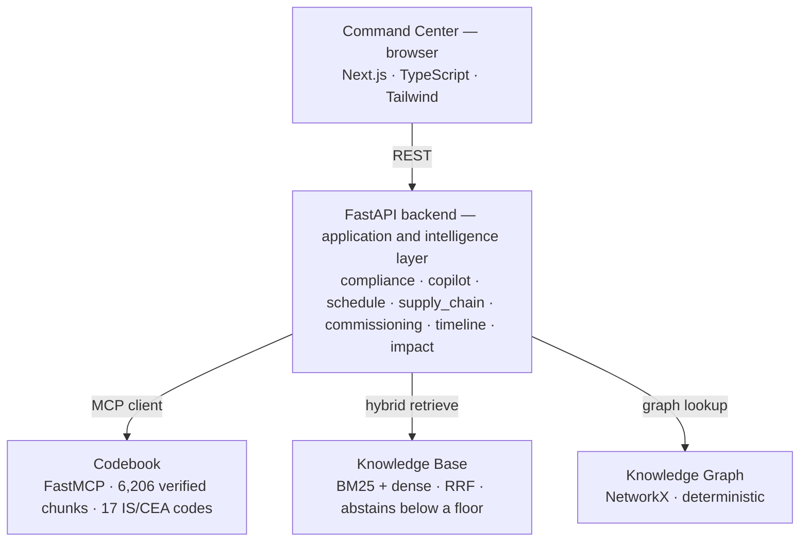
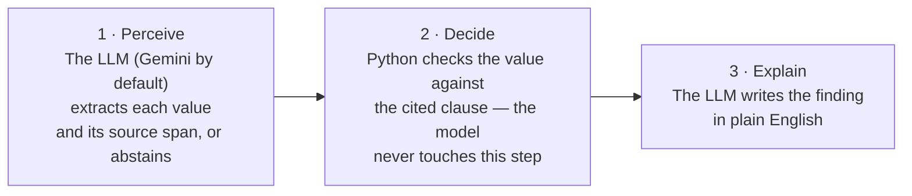

# SiteMind — tamper-proof intelligence for hyperscale & public-infra megaprojects

> Built for the **ET AI Hackathon 2026** as a data-centre EPC compliance tool, then repositioned for
> the **HexaFalls** open-innovation hackathon as a general intelligence + **tamper-proof
> accountability** layer for any hyperscale or public-infrastructure megaproject. The canonical build
> spec is **`hexafalls_plan.md`**; this section reflects the current build, not the original pitch.

**One-liner:** every compliance decision on a megaproject — cited to the actual law, decided by
auditable code rather than a black-box model, and (optionally) notarized on a public blockchain so
it can never be quietly altered. Runs fully offline, on-site, with no API key.

SiteMind reads a Design Basis Report or a vendor submittal, pulls out each engineering
parameter **with the exact sentence it came from**, and checks it against the **real Indian
code clause** that governs it. In seconds you get cited non-conformances, a project copilot,
schedule-risk forecasts, supply-chain visibility, and commissioning QA — plus an append-only audit
ledger and (behind flags) offline vector search, Solana notarization, and a multilingual voice bot
for the field.

**Live app:** https://sitemind.awni.in *(reflects the ET AI Hackathon build; the HexaFalls additions
below are flag-gated and run locally — see "Running it")*

## The one idea that matters

Most AI compliance tools either hallucinate a citation or bury the decision inside a model
that just says "trust me." SiteMind splits the work in two so it can't do either — **the LLM never
computes a verdict**:

- **The model perceives and explains.** An LLM (Gemini by default now; Anthropic/Codex also
  supported) reads the document, extracts each value with its source span, and writes the finding
  in plain English.
- **Deterministic Python decides.** Every pass/fail comes from one of two tiers, both computed in
  Python, never by the model:
  - **Certified** — a pre-vetted rule (`checks.py`) checked against a cited clause. The original,
    hand-written tier.
  - **Computed-draft** — for a clause with no pre-vetted rule, the LLM *reads a rule out of the real
    retrieved clause text* into a structured spec, and `rule_eval.py` — a small sandboxed
    expression evaluator, never `eval()`/`exec()` — computes PASS/FAIL as a **DRAFT an engineer
    confirms**. The LLM still never does the arithmetic and never invents a rule; it only lets
    coverage scale past what's been hand-written.

Every citation resolves to real primary-source text — digitised IS/CEA codes, never paraphrased
from a model's memory. Every number in this doc is computed by a real eval, not asserted: the
flagship is **100% rule-decision accuracy vs a 58.5% naive baseline (n=41)**, with a measured
**0% citation-hallucination rate** (`cd backend && python -m eval.run_eval` reproduces this).

**Honesty guardrails, kept on purpose:** "tamper-**evident** / independently verifiable," never
"impossible to corrupt" — the mechanism proves a record wasn't *silently* altered, it doesn't police
human intent. Computed-draft findings are always labelled "AI-drafted, engineer-confirmed" in the
UI, never shown as certified. All project data is synthetic/representative, modelled on public
tenders — the standards and the checking logic are real, and so is anything you upload yourself.

## Architecture



And how a single compliance call is made — a model only ever touches the outer two stages:



**Stack:** Python · FastAPI · scikit-learn · MiniLM embeddings (HF Inference API, falling back to a
local `sentence-transformers` model when it's unavailable) · NetworkX · Next.js 14 · TypeScript ·
Tailwind. No model training anywhere, and no agent-orchestration framework in the verdict core —
the guarantee layer is plain, auditable Python. (LangGraph runs in exactly one place, scoped to the
Copilot conversational edge — see "HexaFalls additions" below — and never touches a verdict.)

## Actian VectorAI DB

Real, offline vector database — not a cloud API, not a numpy fallback relabeled. Grounds every
clause citation in Compliance (and the Copilot agent) with an actual nearest-neighbor search over
the digitised standards corpus.

1. **What it is**
   - Self-hosted container (`docker-compose.actian.yml`, `actian/vectorai:latest`), reached over
     gRPC on `localhost:6574` — no external API, no per-query cost.
   - Real SDK calls, not a hand-rolled REST wrapper: `VectorAIClient`, `PointStruct`,
     `VectorParams`/`Distance`, `collections.create`, `points.upsert`, `points.search` — all in
     `backend/app/retrieval/vector_store.py`.

2. **What's indexed** — 2 live collections
   - `structural_standard_codes` — 6,206 vectors. The primary corpus: real digitised IS/BIS
     structural code text, chunked and embedded.
   - `sitemind_existing_standards` — 29 vectors. SiteMind's own pre-existing clause records, a
     secondary source the Copilot agent can also search.
   - Built from real source files by `backend/app/retrieval/filesystem_corpora.py`.

3. **Hybrid search — dense + sparse, fused**
   - Dense: query text → MiniLM embedding (384-dim) → nearest-neighbor search against Actian.
   - Sparse: the same query, tokenized, scored via `rank_bm25.BM25Okapi` (keyword/lexical match).
   - Fusion: both ranked lists merged with Reciprocal Rank Fusion — `_rrf_fuse()` in
     `backend/app/retrieval/index.py`.
   - Abstention floor: if even the single best dense hit scores below a threshold, the query
     returns nothing rather than force a weak match.

4. **How it grounds a verdict — never decides one**
   - Each check's own plain-English rule text (already hand-written in `checks.py`) *is* the
     retrieval query — querying with a generic parameter description doesn't reliably surface the
     right clause; the rule text does.
   - `backend/app/clause_resolver.py` runs the search and applies an acceptance gate: a hit is only
     trusted if its clause number matches the known clause, or the known clause text is a verbatim
     substring of the retrieved chunk. Anything else falls back to a local cached copy of the same
     clause, visibly labelled in the UI — never silently swapped for a wrong citation.
   - The search result only ever grounds *which clause text gets shown* — the pass/fail decision
     stays entirely in `checks.py`/`rule_eval.py`, untouched by retrieval, same as the core
     "the LLM never computes a verdict" guarantee.

5. **Fails safe, not silently**
   - If Actian is unreachable, `vector_store.py` catches the error and falls back to an equivalent
     local numpy brute-force cosine search — identical interface, so BM25 fusion, the abstention
     floor, and the clause-resolver gate above behave the same either way.
   - Caveat worth stating plainly: this graceful fallback also makes a dead connection easy to
     miss — `/api/health`'s `vector_store` field reports the *configured* backend, not a
     live-proven one. Confirm with a real query, not just that field.

6. **Verified live, with receipts**
   - `python -m eval.run_actian_parity_eval` checks retrieval results against the calibrated
     numpy baseline.
   - A real worked example: querying with the IS 456 footing-cover rule text returns the correct
     clause (IS 456 Cl. 26.4.2.2) at rank 1, cosine score 0.876, searched against all 6,206
     vectors — visible in the compliance UI's citation panel.

7. **Where to see it**
   - `/compliance` → run a check → click any citation → the retrieval provenance block
     (`resolved_via`, `rank`, `score`, `vectors_searched` are shown, not asserted).
   - Toggle: `RETRIEVAL_VECTOR_STORE=actian` in `backend/.env` (numpy remains the code default so
     evals and a keyless/offline boot stay unaffected either way).

## What's real vs representative

- **Real:** every IS/CEA clause and the text it resolves to, the compliance decision logic, all
  22 eval scripts, document parsing (with mandatory abstention on anything it can't confidently
  extract), and the critical-path schedule recomputation.
- **Representative:** the pre-loaded project documents and schedule are synthetic, modelled on
  public Indian data-centre tenders. The standards and the logic that checks them are real — and
  so is anything you upload yourself.

## Running it

**Prerequisites:** Python **3.12** (the pinned numpy/pandas wheels don't build on 3.13+) and
Node 18+. Every API key is optional — the app degrades gracefully, and the pass/fail decision
is deterministic with or without one.

### 1 · Minimal — fully offline, no keys

Compliance and Commissioning QA work end-to-end with no keys.

```bash
cd backend && ./run.sh                       # :8000  (creates .venv, installs deps)
cd frontend && npm install && npm run dev    # :3000
```

Open http://localhost:3000 and watch the top-bar pill: **green** = talking to the real backend,
**red** = you're seeing mock data (wrong API URL or backend down).

### 2 · Add semantic search (free Hugging Face token)

Copilot, Knowledge Base, and Codebook use MiniLM embeddings through the HF Inference API. Drop a
free token (read scope, from huggingface.co/settings/tokens) into `backend/.env`:

```env
HF_TOKEN=hf_xxxxxxxx
```

Then run all three services:

```bash
cd standards-service && ./run.sh                               # :8010  (Codebook)
cd backend && CODEBOOK_ENABLED=1 RETRIEVAL_ENABLED=1 ./run.sh   # :8000
cd frontend && npm run dev                                      # :3000
```

### 3 · Add LLM prose (optional)

An LLM writes the findings and answers when a key is set; with no key everything falls back to
deterministic templates. Set your API keys in `backend/.env` (see `backend/.env.example` for all options):

```env
IAMHC_API_KEY=sk-your-iamhc-key
IAMHC_BASE_URL=https://api.iamhc.cn/v1
```

Keys only affect prose and semantic search — **never a verdict**.

**Optional — LLM document extraction (no API key needed).** The compliance upload can read parameters
out of *unseen* phrasing (not just anticipated wording) using Claude via the Claude Agent SDK, on your
Claude Code **subscription** — not a metered key. Every value the model returns passes a deterministic
span-verification gate (the quote must be literally in the document and contain the value) before it
reaches the check, so the zero-hallucination guarantee holds and the regex path stays as the fallback.

```bash
cd backend && VIRTUAL_ENV=.venv uv pip install claude-agent-sdk   # needs the `claude` CLI on PATH
claude setup-token                                                # paste result into backend/.env:
#   CLAUDE_CODE_OAUTH_TOKEN=...
#   LLM_EXTRACTION_ENABLED=1
```

With the flag unset, extraction is the deterministic regex path — the default, and what the demo records.

### 4 · Add the conversational Copilot agent + Telegram field bot (optional)

`COPILOT_AGENT_ENABLED=1` turns the single-shot Copilot into a multi-turn LangGraph agent
(`POST /api/copilot/chat`) with read-only tools across NCRs, schedule risk, supply chain, and both
retrieval corpora, plus per-thread conversation memory. Needs `RETRIEVAL_ENABLED=1` and a
`GEMINI_API_KEY` (falls back to the single-shot answerer on any error, including a quota 429).

```bash
cd backend && COPILOT_AGENT_ENABLED=1 RETRIEVAL_ENABLED=1 ./run.sh   # GEMINI_API_KEY in .env
```

The Telegram field bot (`telegram-bot/`) is a thin client of that same endpoint — send it a voice
note or text in Hindi/English/a regional language, it replies with cited text + voice
(ElevenLabs STT/TTS, Gemini translation), and caches repeat questions so they don't re-spend quota.

```bash
cd telegram-bot && cp .env.example .env   # fill in TELEGRAM_BOT_TOKEN, ELEVENLABS_API_KEY, IAMHC_API_KEY
./run.sh
```

## Features

- **Compliance Agent** (`/compliance`) — upload a DBR/submittal, get NCRs with a cited clause, the
  exact source span, and a confidence-scored action brief. Click any citation to open an in-app
  clause viewer — the real source document's own text, read straight off disk, not an external link.
- **Spatial Compliance** (`/compliance` "Floor Plan" panel) — upload a layout narrative, get a
  deterministic 2D floor map with NCRs pinned onto the geometry that failed (CEA switchboard
  clearances, NBC dead-end/travel-distance/exit-width egress rules). A room's dimensions and
  position are only ever drawn as fact when the document actually states them — an unstated room
  renders hatched, and a check never reads an inferred value. Reproduce it with the bundled demo
  file: `backend/data/project_docs/live_upload_samples/DC1-05-DBR-0007-R1_Layout-Design-Basis.md`
  → `POST /api/compliance/floor-plan`. Rack/aisle geometry is rendered for context but deliberately
  never judged (no freely redistributable governing clause — see `docs/gaps.md`).
- **Project Copilot** (`/copilot`) — cross-document Q&A with citations; guardrailed hybrid
  retrieval (BM25 + dense, reciprocal-rank fused); abstains below a floor instead of guessing.
- **Schedule Risk** (`/schedule`) — CPM + leading-indicator rules (procurement, weather,
  workforce) with recomputed finish impact and three mitigation agents.
- **Supply Chain** (`/supply-chain`) — multi-tier shipment tracking, delay propagation,
  root-cause attribution, severity-tiered alerts.
- **Commissioning QA** (`/commissioning`) — cooling test-log CSV → pass/allowable/fail against an
  ASHRAE thermal envelope → exportable quality package.
- **Timeline** (`/timeline`) — every NCR, RFI, risk, and alert from the five pillars on one
  cross-linked view. Pure aggregation, zero new judgement.
- **Knowledge Graph** (`/graph`) — equipment → spec → standard → RFI, deterministic (NetworkX)
  and clickable, not a vector guess.
- **Codebook** (`/codebook`, `standards-service/`) — a standalone, MCP-consumable standards
  service any agent can query, plus a console for browsing corpora.
- **Audit Ledger** (`/audit`) — every finalized compliance decision recorded once, append-only, via
  a content hash (MongoDB Atlas if `MONGODB_URI` is set, else a local JSONL fallback — same
  idempotency either way). Optionally anchors that hash on Solana devnet so anyone can independently
  verify a record wasn't altered after the fact, without trusting SiteMind's own database.

### HexaFalls additions (flag-gated, default-off, run locally)

These don't change the core demo above — each is off by default and the app degrades gracefully
without it. See `hexafalls_plan.md` §9 for the full env var table.

- **Offline vector search (Actian VectorAI DB)** — see the dedicated **Actian VectorAI DB** section
  above for the full implementation writeup.
- **Solana devnet notarization** — `SOLANA_ENABLED=1` anchors audit-ledger hashes on-chain (see
  Audit Ledger above); needs a funded devnet keypair (`backend/scripts/solana_setup.py`).
- **Copilot conversational edge (LangGraph)** — `COPILOT_AGENT_ENABLED=1` turns the single-shot
  Copilot into a multi-turn agent (`POST /api/copilot/chat`) that routes across pillars via
  read-only tools and remembers the conversation. This is the only place a general
  agent-orchestration framework runs — it never decides a verdict, only routes and phrases answers.
- **Telegram field bot (`telegram-bot/`)** — a standalone multilingual voice bot: send a voice note
  in Hindi/English/regional language, get a cited answer back as voice + text (ElevenLabs
  STT+TTS, Gemini translation, calling the full Copilot agent's `/api/copilot/chat`, with
  per-chat memory and a reply cache for repeat questions). See "Running it" §4 above.

## Evals

22 re-runnable eval scripts (19 in `backend/eval/`, 3 in the Codebook service), each reported on
its own — never blended into a single vanity score.

```bash
cd backend && source .venv/bin/activate && python -m eval.run_eval
```

Spatial Compliance's checks are evaluated separately (never blended into the number above):

```bash
cd backend && source .venv/bin/activate && python -m eval.run_spatial_eval   # -> eval/spatial_report.json
```

## Known caveats (disclosed, not hidden)

- Semantic search needs a free `HF_TOKEN`; Compliance and Commissioning need no keys at all.
- ROI figures (~20 engineer-hrs and ~₹15L per issue) are labelled assumptions, not measurements.
- All project data is synthetic/representative, modelled on public tenders — see `docs/know.md`
  for the full real-vs-synthetic breakdown and judge Q&A prep.
- The full list of what's still imperfect, kept honest on purpose, is `docs/gaps.md`.

## Roadmap

Every check maps to a real digitised clause, so coverage grows by **adding clauses, not
retraining a model**. Next in line: IS 875 (wind), IS 13920 (seismic detailing), IS 800 (steel),
and NBC 2016 (fire and egress).
